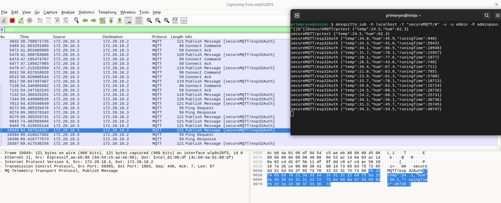
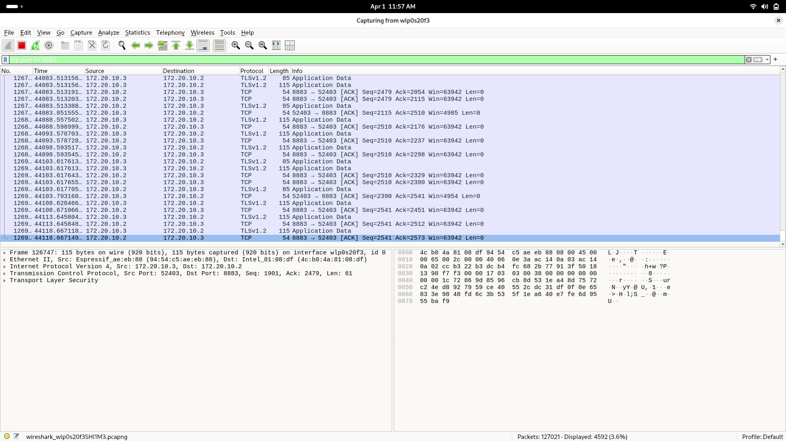

# 🔐 IoT MQTT Security — TP4

> A complete hands-on lab for analyzing and securing an IoT architecture based on the MQTT protocol.  
> **Stack:** Debian Linux · Mosquitto 2.0.21 · ESP32 (real hardware) · PlatformIO · Wireshark · OpenSSL

---

## 📋 Table of Contents

- [Overview](#overview)
- [Architecture](#architecture)
- [Prerequisites](#prerequisites)
- [Part 1 — Deploying the IoT Architecture](#part-1--deploying-the-iot-architecture)
- [Part 2 — Vulnerability Analysis](#part-2--vulnerability-analysis)
- [Part 3 — Authentication Setup](#part-3--authentication-setup)
- [Part 4 — TLS Implementation](#part-4--tls-implementation)
- [Part 5 — Comparative Analysis](#part-5--comparative-analysis)
- [Bonus — mTLS](#bonus--mtls)
- [Performance Benchmark Results](#performance-benchmark-results)
- [Security Summary](#security-summary)
- [Project Structure](#project-structure)

---

## Overview

This project demonstrates a **progressive security hardening** approach for an IoT system using MQTT:

1. Deploy a **vulnerable** MQTT architecture
2. **Analyze** its weaknesses using network capture tools
3. **Secure** it step by step with authentication and TLS encryption
4. **Benchmark** performance before and after hardening

---

## Architecture

```
ESP32 (172.20.10.3)          Debian PC (172.20.10.2)
┌─────────────────┐          ┌──────────────────────┐
│  Sensor (IoT)   │  WiFi    │  Mosquitto Broker     │
│  PlatformIO     │ ──────►  │  Port 1883 (plain)    │
│  PubSubClient   │  LAN     │  Port 8883 (TLS)      │
│  temp + hum     │          │                       │
│  every 5 sec    │          │  mosquitto_sub (CLI)  │
└─────────────────┘          └──────────────────────┘
                                       │
                              Wireshark / tcpdump
                              (interface wlp0s20f3)
```

| Component | Details |
|---|---|
| **ESP32** | Real hardware — publishes `{"temp": x, "hum": x}` every 5 seconds |
| **Broker** | Mosquitto 2.0.21 on Debian Linux |
| **Network** | WiFi hotspot `172.20.10.x` |
| **Capture** | Wireshark + tcpdump on `wlp0s20f3` |
| **IDE** | PlatformIO (VSCode) |

---

## Prerequisites

### Debian Machine (Broker)

```bash
sudo apt update && sudo apt upgrade -y
sudo apt install mosquitto mosquitto-clients -y
sudo apt install wireshark tcpdump openssl -y
sudo usermod -aG wireshark $USER
```

### ESP32 (PlatformIO)

Add to `platformio.ini`:

```ini
[env:esp32dev]
platform = espressif32
board = esp32dev
framework = arduino
monitor_speed = 115200
lib_deps = knolleary/PubSubClient@^2.8
```

---

## Part 1 — Deploying the IoT Architecture

### 1. Configure Mosquitto (no security)

Create `/etc/mosquitto/conf.d/tp4.conf`:

```
listener 1883
allow_anonymous true
```

```bash
sudo systemctl enable mosquitto
sudo systemctl restart mosquitto
ss -tlnp | grep 1883
```

### 2. ESP32 Publisher Code

See [`esp32/part1_nosecurity/src/main.cpp`](esp32/src/main_part1_nosecurity.cpp)

Connects to broker on port 1883 with no credentials.

```cpp
#include <WiFi.h>
#include <PubSubClient.h>

const char* ssid        = "YOUR_WIFI";
const char* password    = "YOUR_PASSWORD";
const char* mqtt_server = "172.20.10.2";  // Debian IP
const int   mqtt_port   = 1883;

WiFiClient espClient;
PubSubClient client(espClient);

void connectMQTT() {
  while (!client.connected()) {
    if (client.connect("esp32_sensor")) {
      Serial.println("Connected!");
    } else { delay(2000); }
  }
}

void loop() {
  if (!client.connected()) connectMQTT();
  client.loop();
  float temp = 20.0 + random(0, 150) / 10.0;
  float hum  = 40.0 + random(0, 400) / 10.0;
  String payload = "{\"temp\":" + String(temp, 1)
                 + ",\"hum\":"  + String(hum, 1) + "}";
  client.publish("iot/sensor/data", payload.c_str());
  delay(5000);
}
```

### 3. CLI Subscriber (verify reception)

```bash
mosquitto_sub -h localhost -t "iot/#" -v
```

Expected output every 5 seconds:
```
iot/sensor/data {"temp":24.5,"hum":62.3}
```

---

## Part 2 — Vulnerability Analysis

### Capture MQTT Traffic

```bash
# Live ASCII capture (shows plaintext payload)
sudo tcpdump -i wlp0s20f3 port 1883 -A

# Save to file for Wireshark
sudo tcpdump -i wlp0s20f3 port 1883 -w ~/part2_vulnerable.pcap
wireshark ~/part2_vulnerable.pcap
```

**Wireshark filter:** `tcp.port == 1883`


### Wireshark — MQTT plaintext (port 1883)


*Figure 1: MQTT PUBLISH packet showing topic `iot/sensor/data` 
and payload `{"temp":24.5,"hum":62.3}` in plaintext*
### Findings
When inspecting a **PUBLISH** packet in Wireshark:

```
MQ Telemetry Transport Protocol, Publish Message
  Topic: iot/sensor/data              ← visible in plaintext ⚠️
  Message: {"temp":24.5,"hum":62.3}   ← visible in plaintext ⚠️
```

| Question | Answer |
|---|---|
| Data in cleartext? | ✅ YES — readable in Wireshark with no tools |
| Topics identifiable? | ✅ YES — `iot/sensor/data` visible in every packet |
| Pub/sub without auth? | ✅ YES — `allow_anonymous true` |
| Possible attacks? | Sniffing, MitM, message injection, identity spoofing, DoS |

---

## Part 3 — Authentication Setup

### 1. Create Password File

```bash
sudo mkdir -p /etc/mosquitto/auth
sudo mosquitto_passwd -c /etc/mosquitto/auth/passwd esp32    # password: esp32pass
sudo mosquitto_passwd /etc/mosquitto/auth/passwd admin       # password: adminpass

# Fix permissions
sudo chown mosquitto:mosquitto /etc/mosquitto/auth/passwd
sudo chmod 640 /etc/mosquitto/auth/passwd
```

### 2. Update Broker Config

```
listener 1883
allow_anonymous false
password_file /etc/mosquitto/auth/passwd
```

```bash
sudo systemctl restart mosquitto
```

### 3. Update ESP32 Code

```cpp
void connectMQTT() {
  while (!client.connected()) {
    if (client.connect("esp32_device", "esp32", "esp32pass")) {
      Serial.println("Connected with auth!");
    } else { delay(2000); }
  }
}
```

### 4. Test Authentication

```bash
# Should be REFUSED ❌
mosquitto_sub -h localhost -t "iot/#" -v

# Should be ACCEPTED ✅
mosquitto_sub -h localhost -t "iot/#" -v -u admin -P adminpass
```

| Test | Command | Result |
|---|---|---|
| No credentials | `mosquitto_sub` | ❌ Refused |
| Wrong password | `-u admin -P wrong` | ❌ Refused |
| Correct credentials | `-u admin -P adminpass` | ✅ Accepted |

---

## Part 4 — TLS Implementation

### 1. Generate Certificates

```bash
cd /etc/mosquitto/certs

# Certificate Authority (CA)
sudo openssl genrsa -out ca.key 2048
sudo openssl req -new -x509 -days 1826 -key ca.key -out ca.crt \
  -subj "/CN=IoT-CA/O=TP4/C=TN"

# Server certificate
sudo openssl genrsa -out server.key 2048
sudo openssl req -new -key server.key -out server.csr \
  -subj "/CN=localhost/O=TP4/C=TN"
sudo openssl x509 -req -days 360 \
  -in server.csr -CA ca.crt -CAkey ca.key -CAcreateserial -out server.crt

# Permissions
sudo chown mosquitto:mosquitto /etc/mosquitto/certs/*
sudo chmod 644 ca.crt server.crt
sudo chmod 600 server.key
```

### 2. Update Broker Config

```
listener 1883
allow_anonymous false
password_file /etc/mosquitto/auth/passwd

listener 8883
cafile   /etc/mosquitto/certs/ca.crt
certfile /etc/mosquitto/certs/server.crt
keyfile  /etc/mosquitto/certs/server.key
tls_version tlsv1.2
allow_anonymous false
password_file /etc/mosquitto/auth/passwd
```

### 3. Test TLS Handshake

```bash
openssl s_client -connect localhost:8883 \
  -CAfile /etc/mosquitto/certs/ca.crt 2>&1 | grep -E "Verify|error|OK"
# Expected: Verify return code: 0 (ok) ✅
```

### 4. CLI Subscriber/Publisher with TLS

```bash
# Subscriber
mosquitto_sub -h localhost -p 8883 \
  --cafile /etc/mosquitto/certs/ca.crt --insecure \
  -u admin -P adminpass -t "iot/#" -v

# Publisher
mosquitto_pub -h localhost -p 8883 \
  --cafile /etc/mosquitto/certs/ca.crt --insecure \
  -u esp32 -P esp32pass \
  -t "iot/sensor/data" -m '{"temp":24.5,"hum":62.3}'
```

### 5. ESP32 TLS Code

```cpp
#include <WiFiClientSecure.h>
#include <PubSubClient.h>

const char* ca_cert = R"EOF(
-----BEGIN CERTIFICATE-----
(paste ca.crt content here)
-----END CERTIFICATE-----
)EOF";

WiFiClientSecure espClient;

void connectMQTT() {
  espClient.setCACert(ca_cert);
  while (!client.connected()) {
    if (client.connect("esp32_tls", "esp32", "esp32pass")) {
      Serial.println("Connected with TLS!");
    } else { delay(2000); }
  }
}
```

### 6. Wireshark Verification

**Filter:** `tcp.port == 8883`



*Figure 2: TLSv1.2 encrypted traffic — payload unreadable, 
no MQTT layer visible*


```
Transport Layer Security
  TLSv1.2 Record Layer: Application Data
    Encrypted Data: 94 54 c5 ae eb...  ← unreadable ✅
```

No MQTT layer visible — TLS encryption confirmed.

---

## Part 5 — Comparative Analysis

| Security Criteria | No Security | Auth Only | TLS + Auth |
|---|---|---|---|
| Data encryption | ❌ | ❌ | ✅ TLSv1.2 |
| Access control | ❌ | ✅ user/pass | ✅ user/pass |
| MitM protection | ❌ | ❌ | ✅ |
| Sniffing protection | ❌ | ❌ | ✅ |
| Credentials in plaintext | N/A | ⚠️ YES | ✅ Encrypted |
| DoS protection | ❌ | Partial | Partial |

### Remaining Limitations After TLS

- No client-side certificate verification → fix with **mTLS**
- No anomaly detection → fix with **IDS**
- No network isolation → fix with **VLAN segmentation**
- No per-request re-authentication → fix with **Zero Trust**

---

## Bonus — mTLS

Mutual TLS requires both client and broker to present certificates.

```bash
# Generate client certificate for ESP32
sudo openssl genrsa -out /etc/mosquitto/certs/client.key 2048
sudo openssl req -new -key /etc/mosquitto/certs/client.key \
  -out /etc/mosquitto/certs/client.csr \
  -subj "/CN=esp32_device/O=TP4/C=TN"
sudo openssl x509 -req -days 360 \
  -in /etc/mosquitto/certs/client.csr \
  -CA /etc/mosquitto/certs/ca.crt \
  -CAkey /etc/mosquitto/certs/ca.key \
  -CAcreateserial -out /etc/mosquitto/certs/client.crt
```

Add to `tp4.conf`:
```
require_certificate true
use_identity_as_username true
```

| | TLS | mTLS |
|---|---|---|
| Server verified by client | ✅ | ✅ |
| Client verified by broker | ❌ | ✅ |
| Certificate required | Server only | Both sides |

---

## Performance Benchmark Results

Run the benchmark:

```bash
chmod +x benchmark.sh
./benchmark.sh
```

### Results

| Metric | Without TLS (1883) | With TLS (8883) | Overhead |
|---|---|---|---|
| Avg latency (1 msg) | **2 ms** | **52 ms** | +50ms (+2500%) |
| 100 messages total | **0.198 s** | **4.962 s** | x25 slower |
| Estimated throughput | ~505 msg/s | ~20 msg/s | -96% |

> **Note:** This overhead is due to the TLS handshake on each new TCP connection.  
> With a **persistent connection** (normal ESP32 operation), the overhead drops to **< 5ms** after the initial handshake.

### TLS Performance Optimizations

- **Session resumption** — reuse session parameters to skip full handshake
- **Persistent connection** — keep MQTT connection alive between publishes
- **TLS 1.3** — 1 round-trip handshake vs 2 in TLS 1.2
- **ECDSA certificates** — lighter than RSA 2048 on microcontrollers

---

## Security Summary

| OWASP IoT Top 10 | Observed | Fix Applied |
|---|---|---|
| I1 — Weak Passwords | ✅ Part 1 | Part 3: PBKDF2-SHA512 passwd file |
| I2 — Insecure Network Services | ✅ Part 1 | Part 4: TLS port 8883 |
| I3 — Insecure Ecosystem Interfaces | ✅ Part 1 | Auth + mTLS recommended |
| I7 — Insecure Data Transfer | ✅ Part 2 | Part 4: TLS encryption |
| I9 — Insecure Default Settings | ✅ Part 1 | Part 3: `allow_anonymous false` |

---

## Project Structure

```
tp4-mqtt-security/
├── README.md
├── mosquitto/
│   ├── tp4_vulnerable.conf       # Part 1 — no security
│   ├── tp4_auth.conf             # Part 3 — authentication
│   └── tp4_tls.conf              # Part 4 — TLS + auth
├── esp32/
│   ├── part1_nosecurity/
│   │   └── src/main.cpp          # Plain MQTT publisher
│   ├── part3_auth/
│   │   └── src/main.cpp          # MQTT with credentials
│   └── part4_tls/
│       └── src/main.cpp          # MQTT over TLS
├── scripts/
│   ├── benchmark.sh              # Latency and throughput test
│   └── gen_certs.sh              # Certificate generation script
└── captures/
    ├── part2_vulnerable.pcap     # Wireshark — plaintext MQTT
    └── part4_tls.pcap            # Wireshark — encrypted TLS
```

---

## Environment

| Item | Value |
|---|---|
| OS | Debian Linux (PrimaryOS) |
| Broker | Mosquitto 2.0.21 |
| Network | WiFi LAN 172.20.10.x |
| Broker IP | 172.20.10.2 |
| ESP32 IP | 172.20.10.3 |
| IDE | PlatformIO (VSCode) |
| Capture tools | Wireshark, tcpdump |
| Crypto | OpenSSL 3.x |

---

